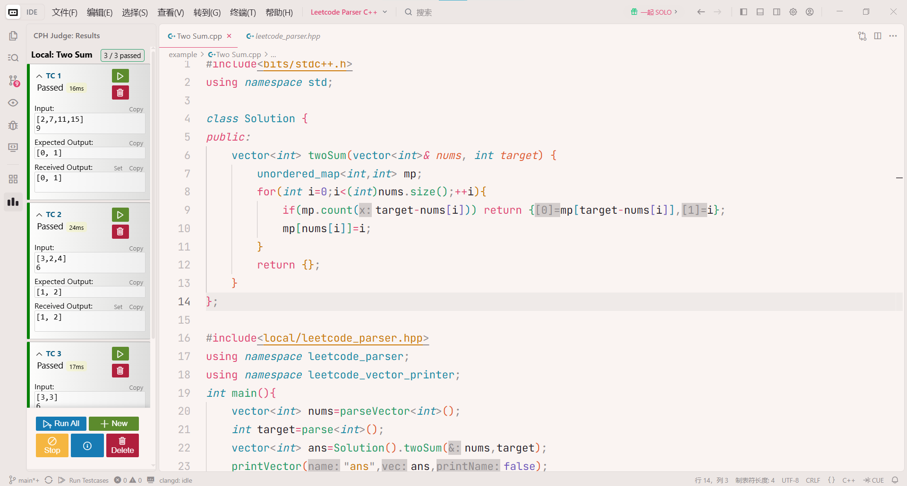

# Leetcode Parser C++

Parse input for C++

Test case format are in [standard.md](./standard.md)

## Installation

Windows, Mingw-w64

```bash
git clone git@github.com:EricMegalovania/Leetcode-Parser-Cpp.git
```

put `leetcode_parser.hpp` to somewhere like

```bash
PATH_TO_MINGW64_FOLDER\mingw64\lib\gcc\x86_64-w64-mingw32\11.5.0\include\c++\local
```

## Usage



**Suggest to use along with [cph](https://github.com/agrawal-d/cph) !!!**

Copy raw inputs to test cases, and you can test locally.

```cpp
#include<local/leetcode_parser.hpp>
using namespace leetcode_parser;
using namespace leetcode_vector_printer;

int main(){
    int _int = parse<int>();
	long long _ll = parse<long long>();
	bool _bool = parse<bool>();
	double _double = parse<double>();
	char _char = parse<char>();
	string _str = parse<string>();
	vector<int> v_int = parseVector<int>();
	vector<string> v_string = parseVector<string>();
	vector<double> v_double = parseVector<double>();
	vector<vector<int>> vv_int = parseVector2D<int>();
	vector<vector<double>> vv_double = parseVector2D<double>();
    return 0;
}
```

## Testing

```bash
cd ./tests
g++ -O2 -std=c++20 main.cpp -o main
./main
```

output should be like

```text
i1: -1
i2: 0
i3: 2147483647
i4: -2147483648
ll1: -1
ll2: 0
ll3: -9223372036854775808
ll4: 9223372036854775807
b1: true
b2: false
d1: 245.32
d2: 1
d3: -1e+12
c1: 'a'
c2: '
'
c3: '\'
s1: ""
s2: "Hello World"
s3: "1337's "world" \"
v_empty = []
v_int = [1]
v_string = [a, hello, world]
v_double = [114.514, 1919.81]
vv_empty = [
]
vv_1row_0elements = [
  []
]
vv_1row_1element = [
  [1]
]
vv_2x2 = [
  [1, 2],
  [3, 4]
]
vv_3rows = [
  [1],
  [2, 3],
  [4, 5, 6]
]
vv_2x1_double = [
  [114.514],
  [1919.81]
]
```

## License

MIT License