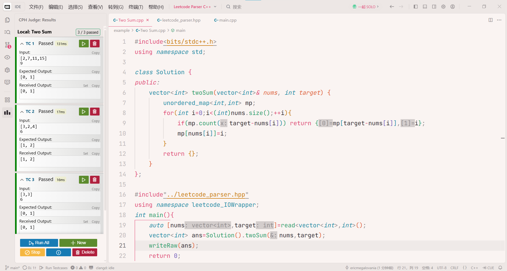

# Leetcode Parser C++

Parse input for C++

Test case format are in [standard.md](./standard.md)

## Installation

Windows, Mingw-w64

```bash
git clone git@github.com:EricMegalovania/Leetcode-Parser-Cpp.git
```

put `leetcode_parser.hpp` to somewhere like

```bash
PATH_TO_MINGW64_FOLDER\mingw64\lib\gcc\x86_64-w64-mingw32\11.5.0\include\c++\local
```

## Usage



**Suggest to use along with [cph](https://github.com/agrawal-d/cph) !!!**

Copy raw inputs to test cases, and you can test locally.

```cpp
#include <bits/stdc++.h>
#include <local/leetcode_parser.hpp>
using namespace std;
using namespace leetcode_IOWrapper;

using LL = long long;
int main() {
    auto [_string, _bool, vv_double, _ll] = read<string, bool, vector<vector<double>>, LL>();
	write(_string, _bool, vv_double, _ll);
    return 0;
}
```

## Testing

```bash
cd ./tests
g++ -O2 -std=c++20 main.cpp -o main
./main
```

output should be like [sample_output](./tests/sample_output.txt)

## License

MIT License